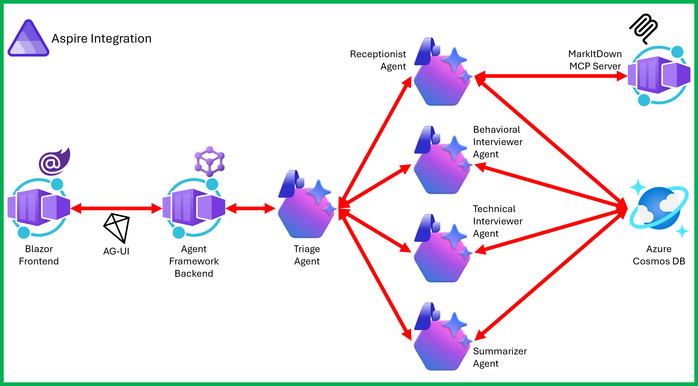

# Interview Coach with Microsoft Agent Framework

An AI-powered interview coach that shows how to wire up [Microsoft Agent Framework](https://aka.ms/agent-framework), [Model Context Protocol (MCP)](https://modelcontextprotocol.io), and [Aspire](https://aspire.dev) into a working application you can deploy.

## What you'll learn

This sample covers the patterns you'd need for a real agent deployment:

- Building AI agents with Microsoft Agent Framework
- Multi-agent handoff orchestration — single agent vs. 5 specialized agents
- Model Context Protocol (MCP) for adding tools without touching agent code
- Running multiple services together with Aspire
- Keeping conversation state across sessions
- Swapping LLM providers (Microsoft Foundry and GitHub Copilot)
- Deploying to Azure with `azd up`

See [learning objectives](docs/LEARNING-OBJECTIVES.md) for the full breakdown.

## Architecture



The app is split into a few services:

- **Aspire** orchestrates everything (service discovery, health checks, config)
- **WebUI** is a Blazor chat interface
- **Agent** runs the interview logic via Microsoft Agent Framework
- **MCP Servers** handle document parsing (MarkItDown) and session storage (InterviewData)
- **LLM Provider** talks to Microsoft Foundry or GitHub Copilot

See [architecture overview](docs/ARCHITECTURE.md) for how the pieces fit together.

## Prerequisites

- [.NET 10 SDK](https://dotnet.microsoft.com/download/dotnet/10.0) or later
- [Visual Studio 2026](https://visualstudio.microsoft.com/downloads/) or [VS Code](https://code.visualstudio.com/download) + [C# Dev Kit](https://marketplace.visualstudio.com/items?itemName=ms-dotnettools.csdevkit)
- [Docker Desktop](https://docs.docker.com/desktop/) or equivalent container runtime

Microsoft Foundry also requires an [Azure subscription](https://azure.microsoft.com/free) and the [Azure CLI](https://learn.microsoft.com/cli/azure/install-azure-cli). GitHub Copilot requires a Copilot-enabled account and GitHub authentication. See [LLM provider options](docs/providers/README.md).

## Getting Started

### 1. Clone Repository

```bash
git clone https://github.com/Azure-Samples/interview-coach-agent-framework.git
cd interview-coach-agent-framework
```

### 2. Choose an LLM provider

Microsoft Foundry is the default. Aspire provisions its resource and `gpt-5-mini` deployment when the app starts. See the [Foundry setup guide](docs/providers/MICROSOFT-FOUNDRY.md), or use [GitHub Copilot](docs/providers/GITHUB-COPILOT.md) without provisioning an Azure model.

### 3. Configure authentication

For Microsoft Foundry, sign in with the Azure CLI:

```bash
az login
```

The agent uses `DefaultAzureCredential`: Azure CLI credentials locally and managed identity when deployed. For GitHub Copilot, follow the [GitHub authentication setup](docs/providers/GITHUB-COPILOT.md#configure-authentication).

### 4. Run the Application

Start all services with .NET Aspire:

```bash
aspire start --apphost ./apphost.cs
```

**What happens next:**

1. Open the Aspire Dashboard from the URL printed in the terminal.
2. Wait for the services to report `Running`.
3. Open the `webui` endpoint.

### 5. Deploy to Azure

Deploy the entire application to Azure Container Apps with one command:

```bash
# Login to Azure
azd auth login

# Provision resources and deploy
azd up
```

### 6. Clean Up Resources

When finished, remove all Azure resources:

```bash
azd down --force --purge
```

## Next Steps

### Learn

- [Learning objectives](docs/LEARNING-OBJECTIVES.md)
- [Architecture overview](docs/ARCHITECTURE.md)
- [Tutorials](docs/TUTORIALS.md)
- [FAQ](docs/FAQ.md)

### Alternative LLM providers

The default is Microsoft Foundry, but you can also use:

- [GitHub Copilot](docs/providers/GITHUB-COPILOT.md) — GitHub Copilot SDK integration

### Alternative agent mode

The default is `HandOff`. You can switch to:

- [`Single`](docs/MULTI-AGENT.md#single-mode) - single-agent mode

## Additional Resources

### Microsoft Foundry

- [What is Microsoft Foundry?](https://learn.microsoft.com/azure/ai-foundry/what-is-foundry?view=foundry)
- [Foundry models](https://learn.microsoft.com/azure/ai-foundry/foundry-models/overview)

### Microsoft Agent Framework

- [Framework Documentation](https://aka.ms/agent-framework)
- [Multi-agent orchestration](https://learn.microsoft.com/agent-framework/workflows/orchestrations/)
- [AG-UI Protocol](https://docs.ag-ui.com/introduction)

### Model Context Protocol

- [MarkItDown MCP Server](https://github.com/microsoft/markitdown/tree/main/packages/markitdown-mcp)
- [MCP Specification](https://modelcontextprotocol.io)
- [MCP Server Registry](https://github.com/modelcontextprotocol/servers)

### Aspire

- [Aspire Documentation](https://aspire.dev)
- [Integrations](https://aspire.dev/integrations/overview/)
- [Deployment](https://aspire.dev/deployment/overview/)

## Contributing

We welcome contributions! Please see [CONTRIBUTING.md](docs/CONTRIBUTING.md) for guidelines.

## License

This project is licensed under the MIT License - see [LICENSE.md](LICENSE.md) for details.

---

Built by the CoreAI DevRel team | Questions? Check the [FAQ](docs/FAQ.md) or open an [issue](https://github.com/Azure-Samples/interview-coach-agent-framework/issues/new).
