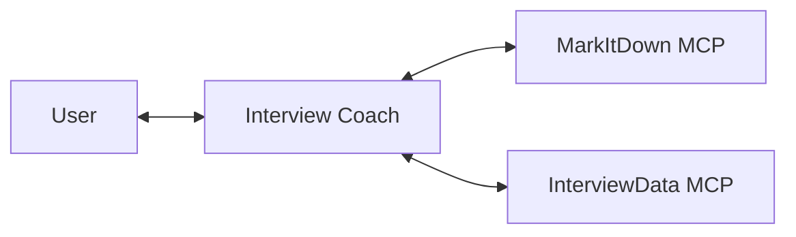
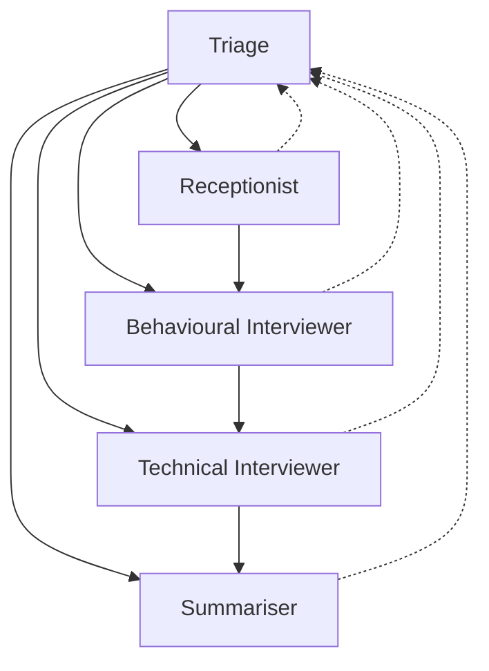

# Agent modes

The interview coach supports two agent modes. Both work with Microsoft Foundry and GitHub Copilot.

## Overview

| Mode      | Approach                                                 | Agents | Best for                                       |
|-----------|----------------------------------------------------------|--------|------------------------------------------------|
| `Single`  | One agent handles the full interview                     | 1      | Simpler deployments and debugging              |
| `HandOff` | Specialists transfer control as the interview progresses | 5      | Focused prompts and tool access for each phase |

Choose the mode and provider independently in `apphost.settings.json`:

```json
{
  "AgentMode": "HandOff",
  "LlmProvider": "GitHubCopilot"
}
```

Command-line arguments override the settings file:

```bash
# Single agent with Microsoft Foundry
aspire start --apphost ./apphost.cs -- --provider MicrosoftFoundry --mode Single

# Multi-agent handoff with GitHub Copilot
aspire start --apphost ./apphost.cs -- --provider GitHubCopilot --mode HandOff
```

## Single mode

`Single` creates one agent with access to the MarkItDown and InterviewData MCP tools. Its instructions cover session setup, document intake, behavioural questions, technical questions, and the final summary.



Use this mode when one prompt and one tool set are enough.

## HandOff mode

`HandOff` creates five agents connected through Microsoft Agent Framework's handoff workflow:



Triage selects the current phase. The normal path runs Receptionist, Behavioural Interviewer, Technical Interviewer, then Summariser. A specialist can return to Triage when the user asks to change direction.

| Agent                   | Job                                                | MCP tools                    |
|-------------------------|----------------------------------------------------|------------------------------|
| Triage                  | Routes the conversation                            | None                         |
| Receptionist            | Creates the session and collects documents         | MarkItDown and InterviewData |
| Behavioural Interviewer | Runs the behavioural interview                     | InterviewData                |
| Technical Interviewer   | Runs the technical interview                       | InterviewData                |
| Summariser              | Writes the final summary and completes the session | InterviewData                |

Each specialist receives only the tools it needs. Interview state remains in Azure Cosmos DB and is accessed through InterviewData MCP rather than directly by an agent.

## Provider behavior

The workflow does not contain provider-specific copies of the agents:

- Microsoft Foundry creates `ChatClientAgent` instances through `IChatClient`.
- GitHub Copilot creates Agent Framework agents through `CopilotClient.AsAIAgent`.
- The same instructions, MCP tools, and handoff topology are used for every provider.

This keeps `AgentMode` focused on orchestration. Changing `LlmProvider` changes the model backend without changing the interview flow.

## Resources

- [Microsoft Agent Framework multi-agent orchestrations](https://learn.microsoft.com/agent-framework/workflows/orchestrations/)
- [Handoff orchestration](https://learn.microsoft.com/agent-framework/workflows/orchestrations/handoff)
- [GitHub Copilot agent provider](https://learn.microsoft.com/agent-framework/agents/providers/github-copilot)
